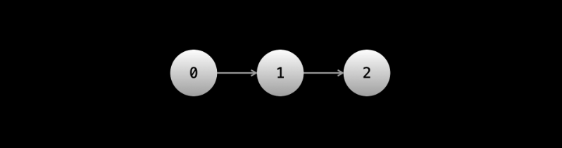
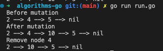

## Linked Lists
First, this is similar to arrays which are data structures that are implemented such that items are stored contiguously in memory with each item either holding a value or an address.
A linked list is a data structure similar to an array, only that it is implemented using node objects for Items. Each Node will have 2 fields; "Data" holding its value and "Next".


An example for creating a LinkedList to represent the data `1 --> 2 --> 3`

```go
package main

import "fmt"

func main() {
	type ListNode struct {
		data int
		next *ListNode
	}

	list1 := &ListNode{data: 1}
	list2 := &ListNode{data: 2}
	list3 := &ListNode{data: 3}
	list1.next = list2
	list2.next = list3

	head := list1

	fmt.Println(head.data)
	fmt.Printf("%v \n", head.next.data)
	fmt.Println(head.next.next.data)
}
```

### Advantages and Disadvantages compared to Arrays
One main advantage of a linkedList is that we can achieve Add/Removal of an item with O(1). However, you must have a reference to this item otherwise, you have to do it with O(n) by running through all elements from the head.

This is still better than the array which is always 0(n) for removing/adding at any arbitrary position since it will either involve shifting or iterating the original list.

One main disadvantage of the linkedin list is that it does not have the constant time random access Arrays have in 0(1).

One advantage of linkLists is that they do not have a fixed size and can grow unlike arrays that are fixed. Depending on the language implementation, they can expand like slices in Go only that under the hood the array is simply increased.

Also, linkedLists may also have the issue of size since by default every item requires a pointer and reference on the heap. for manipulating tiny primitives, you may be using more memory for a small sample items.

## Using Linked lists
These show the mechanics of working with Linked lists

### Assignment
Use `=` to assign a pointer to an existing node.
After the below `ptr` still remains as `head`. The only way to reassign a node is by direct assignment.

```go
	head := &ListNode{ val: 1}

	ptr := head
	head = head.next;
	head = nil

	fmt.Println(ptr, head)
```

### Traversal
Iterating forward through the list can be can be done with a simple loop. Example, Implement a function that accepts the head of a list and sums it up to the last element.

```go
package main

import (
    "fmt"
)

func main() {
    node1 := &LinkedList{ data: 2 }
    node2 := &LinkedList{ data: 2 }
    node3 := &LinkedList{ data: 2 }
    
    head := node1
    node1.next = node2
    node2.next = node3

    fmt.Println(getSum(head))

}

type LinkedList struct {
    data int
    next *LinkedList
}

func getSum(head *LinkedList) int {
    sum := 0

    for head != nil {
        sum = sum + head.data
        head = head.next
    }

    return sum
}
```

With recursion
```go
func getSum(head *LinkedList) int {
    
	if head == nil {
		return 0
	}

    return head.data + getSum(head.next)
}
```

## Types of Linked lists
### Singly linked list
This is the most common type of linked list. It only moves forward and has a field mostly called `next` for this.

Lets do some operations such as add and remove from a singly linked list. But first, we need to print the list.

```go
package main

import (
    "fmt"
)

func main() {
    head := &LinkNode{ data: 2 }
    node1 := &LinkNode{ data: 4 }
    node2 := &LinkNode{ data: 5 }

    head.next = node1
    node1.next = node2

    head.print()
}

type LinkNode struct {
    data int
    next *LinkNode
}

func (n *LinkNode) print() {
    for n != nil {
        fmt.Printf("%d --> ", n.data)
        n = n.next
    }

    fmt.Printf("nil \n")
}
```

#### Add to list
To add, we simply need the prev node.
```go
func addNode(prevNode *LinkNode, nodeToAdd *LinkNode) {
    nodeToAdd.next = prevNode.next
    prevNode.next = nodeToAdd
}
```

#### Remove from list
To remove, we simply need the prev node also.
```go
func removeNode(prevNode *LinkNode) {
    prevNode.next = prevNode.next.next
}
```

For Add and Remove, if you have the prev node, it is o(1) otherwise, you will need to traverse to this `prev` node and the complexity becomes O(n).

```go
package main

import (
	"fmt"
)

func main() {
	head := &LinkNode{data: 2}
	node1 := &LinkNode{data: 4}
	node2 := &LinkNode{data: 5}

	head.next = node1
	node1.next = node2

	fmt.Println("Before mutation")
	head.print()
	addNode(node1, &LinkNode{data: 10})
	fmt.Println("After mutation")
	head.print()
	fmt.Println("Remove node 2")
	removeNode(head)
	head.print()
}

type LinkNode struct {
	data int
	next *LinkNode
}

func (n *LinkNode) print() {
	for n != nil {
		fmt.Printf("%d --> ", n.data)
		n = n.next
	}

	fmt.Printf("nil \n")
}

func addNode(prevNode *LinkNode, nodeToAdd *LinkNode) {
	nodeToAdd.next = prevNode.next
	prevNode.next = nodeToAdd
}

func removeNode(prevNode *LinkNode) {
	prevNode.next = prevNode.next.next
}
```


### Doubly linked list
This is like a singly linked list, only that each node now has a pointer to the previous node usually called `prev`.
In essence, we can now move back and forth.

#### TODO: complete the section.


## Fast and Slow pointers
