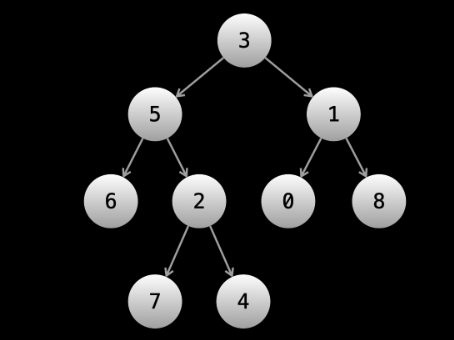

# Tree and Graphs

A graph is a cluster or collection of nodes and their pointers to other Nodes.

Linked lists and trees are both types of Graphs.

- Nodes on a graph are called vertices.
- Pointers on the graph connecting vertices are called edges.

## Trees
A tree is a type of Graph and there are multiple types of trees.

In a tree, the start is called the `root` and each vertex has a pointer to `children`. If a node `A` is pointing to `B`, then `B` is a child of `A` and `A` is the parent of `B`.

The root is the only node that has no parent.

### Binary Tree
A tree is binary when all parents have a maximum of two children.



### Tree terminology
Some tree terminologies
- Leaf Node:
A node with no child is called a `leaf node`
- Depth:
The depth of a node is how far it is from the root. The root has a depth of `1`. Every other vertex has a depth of `parentsDepth + 1`.
- Subtree:
A subtree is simply a node and its descendants. Every subtree can be treated as its own tree with the chosen node as its root. Basically, you can take any given node and make it its own tree.

## Representation

```go
package main

type TreeNode struct {
    val int
    left *TreeNode
    right *TreeNode
}
```
